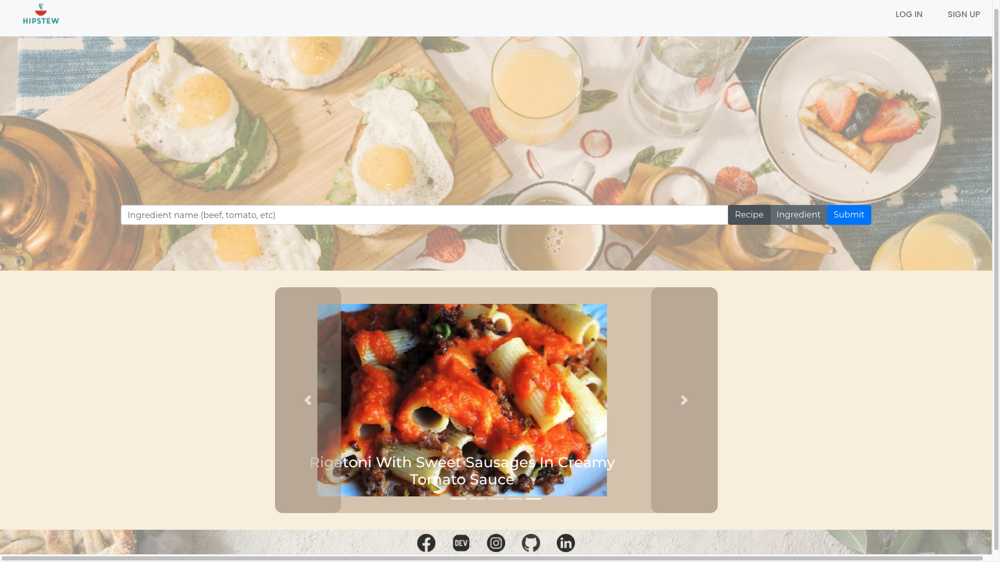
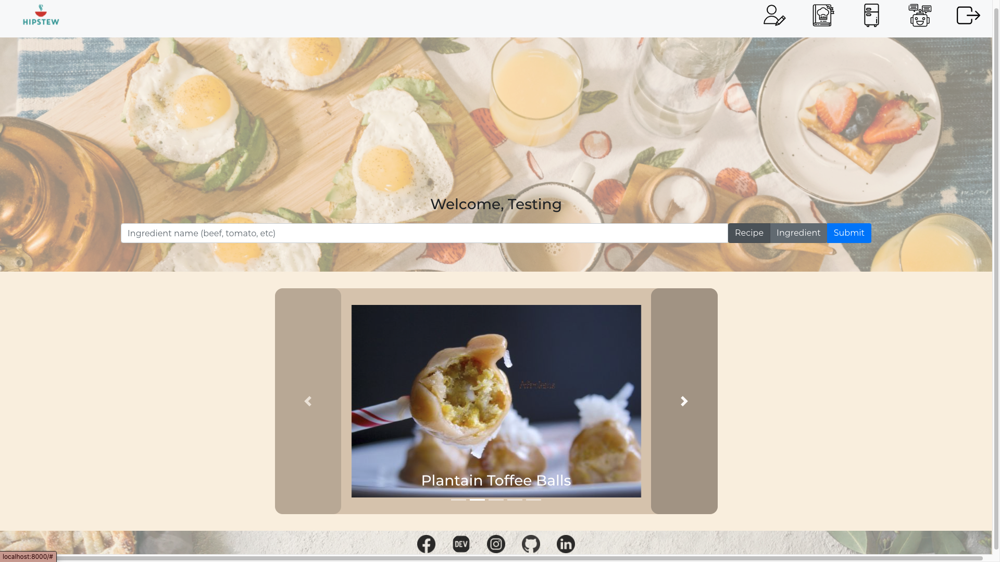

# Hipstew (Frontend)

Hipstew is built to help user look for recipes based on ingredients instead of name. You can also keep track of your fridge using a Fridge feature and also look up ingredients to add as well! There is also a chatbot, Stewy, who will assist you with conversion, recipe search or just to have a small talk with, be sure to check it out :)!

## Getting Started

These instructions will get you a copy of the project up and running on your local machine for development and testing purposes. See deployment for notes on how to deploy the project on a live system.

Link to Hipstew's backend: https://github.com/nnhk23/hipstew_backend

## Installing

For this program, please type in these following commands in your terminal before starting: 

React Router installation:
```npm i react-router-dom```

React bootstrap installation:
```npm i react-bootstrap bootstrap```

Animation installation:
```npm install animate.css --save```


## Start

(make sure to also complete backend's installing instruction before strating the program :) )

Run ```npm start```

First time user interface:


After logged-in:


## Built With

* [React-Bootstrap](https://react-bootstrap.github.io/) - Styling sheets.
* [Animate CSS](https://animate.style/) - Extra effect.
* [React](https://reactjs.org/) - Main framework.
* [Web Speech API](https://wicg.github.io/speech-api/) - external API responsible for chatbot and voice recognition.

## Authors

* **Kim Nguyen** - [Github Link](https://github.com/nnhk23)

## License

This project is licensed under the MIT License - see the [LICENSE.md](LICENSE.md) file for details

## Acknowledgments

* Inspired by foody apps: Spoonacular, Mealime, Hello Fresh.

## Final Note
Feel free to contact me via socials included in Hipstew's footer. Happy coding!
